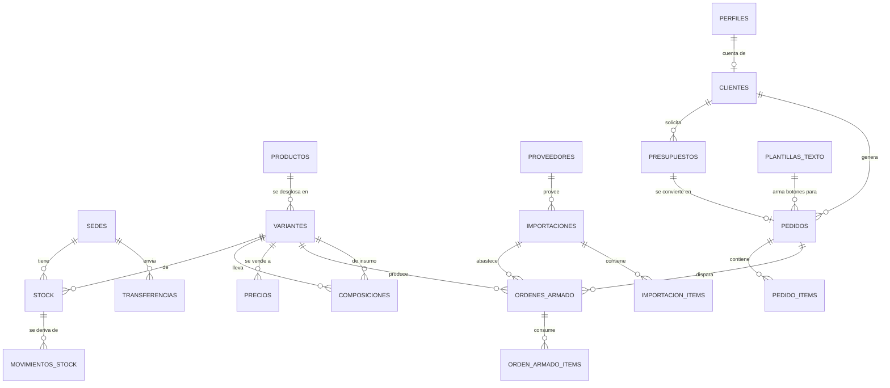

# Importación Táctica — Diseño del sistema

**Versión 3.9 · Agosto 2026**
*Decants de perfume y accesorios · dos administradores · sedes Banfield (central) y Monte Grande*

Documento de arquitectura. El esquema que lo acompaña (`schema.sql`) está cargado y probado contra PostgreSQL 16: **22 tablas, 44 vistas, 137 funciones y 196 pruebas funcionales pasando** en doce suites, incluyendo el cuadre del libro mayor contra el stock en los 13 pares sede/SKU y una suite dedicada sólo a permisos.

**Estado de la construcción: terminado.** Las seis fases están construidas y verificadas —cada una contra PostgreSQL 16 real y contra el navegador, con Chromium sin cabeza recorriendo las pantallas.

**Cambios respecto de la v2**, según lo que definiste:

| | Antes | Ahora |
|---|---|---|
| Precios | 3 listas × escalas × cliente | Un solo precio por rangos de cantidad |
| WhatsApp | API de Meta con cola y costo por mensaje | Botones `wa.me` — sin API, sin costo, sin trámite |
| Venta | Mostrador + online | 100 % online, vía pedidos |
| Cobro | Cuenta corriente y límite de crédito | Paga antes de recibir |
| Facturación | Prevista para más adelante | Fuera del sistema |
| Sedes | Genéricas | Banfield (central) y Monte Grande |

El esquema bajó de 37 a 28 tablas, y después de construirlo todo bajó a **22**: presupuestos, inventarios, imágenes de producto y proveedores se sacaron una vez que quedó claro que ninguna pantalla las necesitaba. Menos superficie que construir, menos que mantener y menos que explicar.

---

## 1. Alcance

| Punto | Definición |
|---|---|
| Stack | Next.js 15 (App Router) + TypeScript + PostgreSQL vía Supabase |
| Hosting | Vercel + Supabase, ambos en plan gratuito para arrancar |
| Roles | **admin** (ustedes dos) y **cliente** |
| Sedes | Banfield (central, recibe las importaciones) y Monte Grande, con transferencias en las dos direcciones |
| Catálogo | Menos de 50 SKUs |
| Precio | Uno solo por variante, escalonado por cantidad |
| Cobro | El cliente paga antes de recibir; el sistema registra el comprobante |
| Contacto | Botones que abren WhatsApp con el mensaje ya escrito |
| Fuera de alcance | Facturación AFIP, cuenta corriente, punto de venta presencial |

---

## 2. Roles

| Rol | Alcance |
|---|---|
| **admin** | Todo: las dos sedes, stock, costos, armado, precios, pedidos, clientes. |
| **cliente** | Su cuenta: catálogo con precios y disponibilidad, generar pedidos, seguir el estado y el número de seguimiento del envío. No ve costos, ni insumos, ni recetas de armado. |

Cada admin tiene una `sede_default` que define cuál aparece preseleccionada en las pantallas — pero ve y opera las dos. Es comodidad de interfaz, no una restricción de permisos.

---

## 3. ABM de productos

Con menos de 50 SKUs, el alta tiene que ser rápida y sin ceremonia. El modelo separa **producto** (el concepto) de **variante** (el SKU que se stockea y se vende).

### Alta paso a paso — el caso "Jeringa de carga"

**1. Crear el producto.**

| Campo | Valor |
|---|---|
| SKU base | `JER` |
| Nombre | Jeringa de carga |
| Descripción corta | Para trasvasar perfume sin derramar |
| Categoría | Accesorios |
| **Atributo que distingue las variantes** | `capacidad` |
| Publicado | sí |

Ese último campo es el que hace cómodo el ABM: al agregar una variante, el formulario rotula el campo con la palabra correcta ("Capacidad") en vez de un genérico "Atributo 1".

**2. Agregar las variantes.**

| SKU | Capacidad | Nombre corto | Clase |
|---|---|---|---|
| `JER-5ML` | 5 ml | Jeringa de carga 5 ml | simple |
| `JER-10ML` | 10 ml | Jeringa de carga 10 ml | simple |

**3. Cargar los precios por rango** (§5).

Listo. Dos pantallas y el producto está publicado.

### Las tres clases de variante

Al crear una variante se elige qué es, y eso define todo lo demás:

| Clase | Ejemplo | Se compra | Se arma | Se vende | La ve el cliente |
|---|---|:-:|:-:|:-:|:-:|
| **Simple** | Jeringa 5 ml, adaptador | ✅ | — | ✅ | ✅ |
| **Insumo** | Frasco 5 ml, tapa dorada, atomizador | ✅ | — | — | ❌ |
| **Armado** | Decant 5 ml tapa dorada | — | ✅ | ✅ | ✅ |

Sólo las variantes **armadas** necesitan un paso extra: cargar la receta.

```
DEC-5-DOR  =  1 × FRA-5ML  +  1 × TAPA-DOR  +  1 × ATO-5  +  1 × ETIQ-STD
```

Cada renglón de la receta admite una **merma esperada** en %, que sirve para planificar cuánto pedir. La merma real se mide sola en cada armado (§6).

---

## 4. Stock bruto vs. armado

Es el centro del diseño y lo que más trabajo le ahorra al día a día.

### 4.1 Vender no depende de tener armado

Por producto y por sede se calculan tres números:

| Número | Qué es |
|---|---|
| **armado_disponible** | Unidades terminadas, listas para poner en una caja |
| **armable** | Cuántas *más* se podrían armar con los insumos libres |
| **vendible** | La suma: lo que realmente se le puede ofrecer a un cliente |

`armable` es el mínimo, entre todos los insumos de la receta, de `disponible ÷ cantidad que lleva`. El insumo que da ese mínimo es el **limitante**, y el sistema lo muestra por nombre.

Prueba real, apenas llegó la importación y **sin haber armado un solo decant**:

| SKU | Armadas | Armable | Vendible | Situación | Limitante |
|---|---:|---:|---:|---|---|
| DEC-5-DOR | 0 | 600 | **600** | requiere armado | TAPA-DOR |
| DEC-5-PLA | 0 | 395 | **395** | requiere armado | TAPA-PLA |
| DEC-10-DOR | 0 | 0 | 0 | sin stock | ATO-10 |

Se pueden vender 600 decants dorados teniendo cero armados. El limitante es la tapa: eso es la lista de compras del próximo embarque, sin tener que sentarse a calcularla.

Después de armar 500 dorados, DEC-5-DOR pasa a *entrega inmediata* con 500 armadas + 100 armables.

> **Productos que comparten insumos.** Dorado y plateado reportan cada uno lo que podrían hacer usando *todos* los frascos libres, así que los números no son sumables. Lo que impide comprometer dos veces el mismo frasco es la reserva, no el cálculo.

### 4.2 Reserva mixta

Al confirmar un pedido, el sistema toma del stock armado lo que pueda y, por el faltante, reserva los **insumos** según la receta.

Prueba real: hay 500 armadas y el cliente pide **550**.

```
PED-2026-00001 · confirmado · pagado · requiere_armado = sí

  DEC-5-DOR   550 pedidas
              500 salen de stock armado
               50 hay que armar
```

Los insumos de esas 50 quedan reservados y ya no cuentan como disponibles. Un segundo pedido de 200 se rechaza con el motivo exacto:

> *No alcanzan los insumos para armar 200 de DEC-5-DOR: faltan 150 de TAPA-DOR*

No un "sin stock" genérico: te dice qué te falta y cuánto.

### 4.3 Del pedido a la orden de armado

Desde el pedido se genera la orden con un click. Al completarla se consumen los insumos, se registra la rotura, entra el producto terminado y **la reserva se traslada sola** de los insumos al armado. El flag `requiere_armado` se apaga.

Dos candados, y son los únicos:

- **No se entrega un pedido con renglones sin armar:** *"El pedido PED-2026-00002 tiene renglones sin armar. Completá las órdenes de armado antes de entregarlo."* No es una regla del sistema, es física: no podés meter en una caja un decant que todavía es un frasco y una tapa.
- **Un producto no armable sin stock se rechaza al confirmar,** con el número exacto de lo que hay.

También existe `fn_desarmar()`: armaste de más o el modelo equivocado y querés devolver las piezas al stock de insumos.

### 4.4 El armado es referencia, no restricción

Se arma contra pedido. Llevar el stock armado por separado **no limita nada**: sirve para saber, de un vistazo, con qué se cuenta.

Si estás tomando un café y entra un pedido para mañana, la pregunta es "¿alcanza con lo que dejé armado o me tengo que poner?". Para eso está `v_resumen_armado`:

| SKU | Armadas | Comprometidas | Libres | Se pueden armar más | Libres por sede |
|---|---:|---:|---:|---:|---|
| DEC-5-PLA | 15 | 0 | **15** | 380 | Banfield 15, Monte Grande 0 |
| DEC-5-DOR | 0 | 0 | 0 | 50 | — |
| DEC-10-DOR | 0 | 0 | 0 | 0 | — |

Con eso ya sabés si podés seguir con el café. **Libres** descuenta lo comprometido a otros pedidos, así que es el número real, no el bruto.

La idea de fondo es que el sistema libere tiempo, y ese tiempo sobrante se use para ir armando stock de a poco. Cuando eso pase, la columna *libres* va a empezar a crecer sola y va a haber cada vez más pedidos que salen el mismo día. El sistema no empuja hacia ahí ni lo exige: sólo lo hace visible.

---

## 5. Precio de venta por rangos

Una sola tabla, un renglón por escalón. Sin listas por cliente, sin historial, sin reglas.

```
precios (variante_id, cantidad_desde, precio_unitario)
```

El sistema muestra el precio que corresponde a la cantidad; los totales y la facturación se hacen por fuera.

Lo que sí hace, y sale gratis porque el costo real ya está calculado, es mostrarte el margen de cada escalón:

| SKU | Desde | Hasta | Precio | Costo real | Margen |
|---|---:|---:|---:|---:|---:|
| DEC-5-DOR | 1 | 9 | $3.500 | $1.864 | **46,7 %** |
| DEC-5-DOR | 10 | 49 | $3.100 | $1.864 | 39,9 % |
| DEC-5-DOR | 50 | 199 | $2.800 | $1.864 | 33,4 % |
| DEC-5-DOR | 200 | y más | $2.500 | $1.864 | **25,4 %** |
| JER-5ML | 1 | 9 | $1.200 | $518 | 56,9 % |
| JER-5ML | 50 | y más | $850 | $518 | 39,1 % |

Ver el margen al lado del precio es lo que evita poner un escalón mayorista que en realidad no deja nada.

---

## 6. Merma: medir lo que se rompe

La rotura aparece en dos momentos y el sistema los separa, porque tienen causas distintas.

**Rotura del viaje** — se cuenta al abrir las cajas:

| Embarque | SKU | Llegó | Roto | % | Costo perdido |
|---|---|---:|---:|---:|---:|
| IMP-2026-001 | FRA-5ML | 1.000 | 40 | **4,00 %** | $34.323 |
| IMP-2026-001 | TAPA-PLA | 400 | 5 | 1,25 % | $1.430 |
| IMP-2026-001 | ATO-5 | 1.000 | 10 | 1,00 % | $6.657 |

**Rotura del armado** — se carga en cada orden:

| Insumo | Armados | Usado en producto | Roto | % | Costo perdido |
|---|---:|---:|---:|---:|---:|
| FRA-5ML | 3 | 570 | 14 | **2,40 %** | $12.013 |
| ATO-5 | 3 | 570 | 3 | 0,52 % | $1.997 |

Los frascos de vidrio se rompen cuatro veces más que los atomizadores en el viaje, y siguen rompiéndose al armar. Con dos o tres embarques hay con qué discutirle el embalaje al proveedor, o con qué decidir pedir 5 % de frascos de más por defecto.

**La rotura entra en el costo.** Si de cada 500 decants se parten 12 frascos y 3 atomizadores, esos 15 los pagan las 500 unidades que sí salieron:

| | Por unidad |
|---|---:|
| Costo teórico de la receta | $1.829,72 |
| **Costo real del armado** | **$1.854,31** |

Además, el costo se recalcula en cada armado. Una tanda chica con la misma rotura absoluta sale más cara por unidad, y el sistema lo refleja.

Hay una vista que atribuye la rotura de armado al embarque de origen, para responder "¿este proveedor rompe más que el otro?". Requiere elegir el lote al crear la orden; si no se elige, la orden queda como *sin atribuir* y sigue contando en el total.

---

## 7. Costeo real de importación

El costo de un frasco importado no es el FOB. Prueba real: $980.000 de flete, derechos y despachante, dólar a $1.250.

| Insumo | FOB en pesos | Gastos prorrateados | **Costo real** | Multiplicador |
|---|---:|---:|---:|---:|
| FRA-5ML | $437,50 | $402,36 | **$858,08** | 1,96× |
| ATO-5 | $350,00 | $312,13 | **$665,67** | 1,90× |
| JER-5ML | $275,00 | $242,79 | **$517,79** | 1,88× |
| TAPA-DOR | $150,00 | $132,43 | **$282,43** | 1,88× |

Dos precisiones que cambian el número:

- Los gastos se prorratean sobre **todo lo que llegó**: el flete y los derechos se pagaron también por los frascos que vinieron rotos.
- El costo se divide entre las **unidades útiles**. La rotura del viaje la absorben las unidades que sirven.

El prorrateo puede hacerse por valor, por peso o por unidades. Para frascos de vidrio —pesados y baratos— el criterio por **peso** reparte el flete de forma más justa que por valor. Vale la pena probar los dos criterios en el primer embarque real y ver cuál refleja mejor lo que pasó.

---

## 8. WhatsApp sin API

No hay cuenta de WhatsApp Business API, ni verificación de Meta, ni plantillas aprobadas, ni costo por mensaje, ni cola de envío.

**Cómo funciona.** En la pantalla del pedido aparecen botones. El sistema arma el enlace `wa.me` con el mensaje ya escrito; el vendedor toca, se le abre el chat de esa persona con el texto cargado, lo edita si quiere y lo manda él.

Los botones cambian según el estado del pedido. Con el pedido **confirmado**:

| Botón | Texto que se abre |
|---|---|
| Escribirle | Hola Martín Gómez! Te escribo de Importación Táctica. |
| Confirmar y pedir el pago | Hola Martín Gómez! Confirmamos tu pedido PED-2026-00003 por $31.000,00. Cuando quieras pasame el comprobante de pago y lo preparamos. |
| Avisar demora | Hola Martín Gómez! Te aviso que tu pedido PED-2026-00003 se nos demora un poco. Apenas tenga novedad te escribo. |

Al pasar a **listo**, el botón que aparece es otro:

> **Avisar que está listo para retirar** — *Hola Martín Gómez! Tu pedido PED-2026-00003 ya está listo para retirar en Monte Grande. Decime cuándo te queda cómodo pasar.*

Los textos viven en una tabla y **se editan desde el ABM**, sin tocar código ni pedirle aprobación a nadie. Admiten los marcadores `{nombre}`, `{numero}`, `{total}`, `{a_pagar}` —el total con el descuento por efectivo—, `{seguimiento}`, `{sede}` y `{direccion}`. Cada uno se asocia a un estado (o a ninguno, y aparece siempre). Si un marcador no tiene valor, la línea entera que lo contiene se cae del mensaje en vez de salir a medias.

Detalles resueltos: el teléfono se normaliza a dígitos sin importar cómo esté cargado (`+54 9 11 4444-0000` → `5491144440000`), el texto se codifica bien con acentos y ñ, y los importes salen en formato argentino (`$31.000,00`).

Adentro del sistema los dos admins siguen teniendo la campanita: pedido nuevo, pedido que requiere armado, stock bajo, diferencia en una transferencia.

---

## 9. Cobro

El cliente paga antes de recibir, así que no hay cuenta corriente ni límite de crédito. Cada pedido guarda `estado_pago`, `metodo_pago`, `referencia_pago` (el número de operación o comprobante) y `pagado_at`.

El sistema **no bloquea** el avance de un pedido impago —a veces uno confirma y el pago llega después— pero mantiene una vista `v_pedidos_sin_pago` que lista los pedidos que avanzaron sin cobro registrado. En condiciones normales esa vista está vacía; si tiene filas, algo se pasó por alto.

---

## 10. Modelo de datos



**22 tablas:**

| Bloque | Tablas |
|---|---|
| Accesos | `perfiles`, `sedes` |
| Catálogo | `productos`, `variantes`, `composiciones`, `categorias` |
| Precio | `precios` |
| Clientes | `clientes` |
| Importación | `importaciones`, `importacion_items` |
| Stock | `stock`, `movimientos_stock`, `ordenes_armado`, `orden_armado_items`, `transferencias`, `transferencia_items` |
| Comercial | `pedidos`, `pedido_items` |
| Avisos | `notificaciones`, `plantillas_texto` |
| Sistema | `auditoria`, `contadores` |

Las seis que se fueron —`presupuestos`, `presupuesto_items`, `inventarios`,
`inventario_items`, `imagenes_producto` y `proveedores`— no las tocaba ninguna
pantalla real. El conteo físico que resolvían `inventarios` lo hace el ajuste
manual de Stock, que exige motivo y queda asentado en el libro mayor.
`proveedores` era un selector en dos formularios sin ABM donde cargar nada; la
comparación de rotura que importa va por `transporte` —avión contra barco—, no
por proveedor, así que no se pierde.

**44 vistas**, entre ellas `v_disponibilidad`, `v_catalogo`, `v_precios_vigentes` (con margen), `v_pendiente_armado`, `v_acciones_whatsapp`, `v_pedidos_sin_pago` y las cuatro de merma.

### Lo que sostiene la integridad

**El stock es un libro mayor.** `movimientos_stock` es inmutable: cada ingreso, armado, consumo, rotura, transferencia y entrega queda asentado con cantidad anterior, posterior, costo, quién y qué documento lo originó. La tabla `stock` es una foto derivada que mantiene un trigger. La aplicación nunca hace `UPDATE stock`. En la prueba, la suma de movimientos cuadra exacto contra el stock en los 11 pares sede/SKU.

**Los pedidos guardan snapshots.** Los renglones conservan el SKU, el nombre y el precio del momento. Si mañana renombrás un producto o cambiás el precio, el pedido de hace tres meses sigue mostrando lo que se acordó.

**Row Level Security en las 22 tablas.** Un cliente sólo lee sus pedidos aunque la app tenga un bug, y no ve insumos, costos ni recetas: la lista de materiales es información del negocio.

---

## 10bis. Circulación entre sedes

Toda la importación entra por **Banfield**. El sistema lo da por sentado: si una importación se carga sin indicar sede de recepción, un trigger la asigna sola a la central. De ahí Banfield transfiere a Monte Grande.

Pero las transferencias son **bilaterales**. Si Banfield vende más rápido y se queda corto, Monte Grande le devuelve, y el modelo no privilegia ninguna dirección: es la misma operación con origen y destino invertidos.

Para no tener que darse cuenta a mano, cada sede puede fijar un mínimo por SKU y el sistema sugiere el movimiento:

| SKU | Desde | Hacia | Tiene destino | Mínimo | Disponible origen | Sugerido |
|---|---|---|---:|---:|---:|---:|
| JER-5ML | Banfield | Monte Grande | 70 | 120 | 230 | **50** |

Mientras la mercadería está en tránsito no figura en ninguna de las dos sedes, y si llega menos de lo enviado la transferencia queda marcada *recibida con diferencias* y se avisa a los dos — la diferencia no se "arregla" sola.

---

## 11. Flujo del pedido

```
Cliente arma el carrito en el portal (precio según cantidad)
        ▼
  PEDIDO pendiente ──► campanita a los dos admins
        │              botón: "Avisar que recibimos el pedido"
        │  el admin revisa
        ▼
  confirmado ──► RESERVA MIXTA: armado + insumos por el faltante
        │        ├─ si no alcanza, la confirmación falla entera
        │        └─ botón: "Confirmar y pedir el pago"
        │
        ├── requiere armado ──► ORDEN DE ARMADO
        │                       (consume insumos, registra rotura,
        │                        traslada la reserva al terminado)
        ▼
  listo ──► botón: "Avisar que está listo para retirar"
        ▼
  enviado / entregado ──► libera reserva + descuenta stock físico
```

Cancelar en cualquier punto libera todo lo reservado, sea armado o insumos.

---

## 12. Arquitectura de la aplicación

```
app/
├── (auth)/           login · registro · recuperar-clave
├── (panel)/          ← admin
│   ├── inicio               por armar · stock bajo · pedidos del día
│   ├── catalogo/            ABM de productos, variantes y recetas
│   ├── precios/             rangos por variante, con margen a la vista
│   ├── stock/               bruto y armado por sede · ajustes · movimientos
│   ├── armado/              cola de armado · órdenes · carga de rotura
│   ├── importaciones/       seguimiento · recepción con conteo de rotura · costeo
│   ├── transferencias/      Banfield ↔ Monte Grande
│   ├── pedidos/             bandeja · confirmar · cobrar · seguimiento · WhatsApp
│   ├── mercadolibre/        carga manual de las ventas del canal
│   ├── clientes/
│   ├── avisos/              lo que el sistema fue anotando solo
│   └── reportes/            ventas · margen · merma · rotación · reposición
├── (portal)/         ← cliente
│   ├── portal/              catálogo con precio por cantidad y carrito
│   ├── mis-pedidos/         estado en palabras · seguimiento del envío
│   └── mis-datos/
└── (sin capa de API externa: no hay webhooks que atender)
```

**Dónde vive la lógica.** Las operaciones que tocan stock —`fn_registrar_movimiento`, `fn_reservar_items_pedido`, `fn_completar_armado`, `fn_recibir_importacion`— están en PostgreSQL, no en TypeScript. Son transaccionales y tienen que ser atómicas: si la reserva vive en la app, dos pedidos simultáneos pueden leer el mismo disponible y comprometer los mismos frascos. En la base, el `SELECT ... FOR UPDATE` lo impide.

**PWA.** El sistema se va a usar desde el celular mientras se arman los frascos. Instalable, y la cámara del teléfono como lector de código de barras para el inventario.

**Carga inicial a mano.** No hay planilla que importar: el inventario se cuenta y se tipea. La pantalla de carga rápida usa `fn_carga_inicial()`: se elige la sede, se busca el SKU, se tipea cantidad, costo, mínimo y ubicación, y queda asentado como movimiento `inventario_inicial`. Dos consecuencias que importan: el libro mayor arranca cuadrado desde el primer día en lugar de tener un saldo salido de la nada, y **corregir un conteo asienta sólo la diferencia**. Si cargaste 40 adaptadores y después contás 37, queda un movimiento de −3 con su fecha, no un 37 que pisa el 40 sin dejar rastro.

---

## 13. Plan de trabajo

| Fase | Contenido | Estimado |
|---|---|---|
| ~~**0 — Base**~~ | ~~Supabase, esquema, auth, los dos admins, layout~~ | ✅ hecho |
| ~~**+ Reportes**~~ | ~~Ventas por día/semana/mes/año, por sede, y carga manual de Mercado Libre~~ | ✅ hecho |
| ~~**1 — ABM y catálogo**~~ | ~~Productos, variantes, recetas, precios por rango~~ | ✅ hecho |
| ~~**2 — Stock y armado**~~ | ~~Movimientos, ajustes, órdenes de armado con rotura, disponibilidad~~ | ✅ hecho |
| ~~**3 — Importaciones**~~ | ~~Recepción con conteo de rotura, costeo, transferencias~~ | ✅ hecho |
| ~~**4 — Pedidos**~~ | ~~Bandeja, reserva mixta, generación de armados, cobro, botones WhatsApp~~ | ✅ hecho |
| ~~**5 — Portal cliente**~~ | ~~Registro, catálogo con disponibilidad, carrito, seguimiento~~ | ✅ hecho |
| ~~**6 — Reportes**~~ | ~~Merma, rotación, margen, sugerencia de reposición~~ | ✅ hecho |

**El plan está completo.** El sistema reemplaza la planilla de punta a punta: entra la importación, se arma, se vende por el panel o por el portal, y los reportes cierran el círculo diciendo qué conviene traer en el próximo embarque.

Sugerencia fuerte: cargar el inventario real y operar con el sistema un par de semanas antes de construir el portal del cliente. Los ajustes que salgan de ese uso valen más que cualquier feature planificada de antemano — sobre todo en el armado, donde manda el flujo de trabajo físico.

### Costos mensuales

| Servicio | Arranque | Cuando crezca |
|---|---|---|
| Supabase | Gratis (500 MB) | Pro, US$25 |
| Vercel | Gratis | Pro, US$20 |
| WhatsApp | **$0** — no hay API | **$0** |
| Dominio | ~US$15/año | — |

Con menos de 50 SKUs y dos sedes, el plan gratuito de Supabase alcanza y sobra por bastante tiempo. Arrancar cuesta el dominio y nada más.

---

## 14. Ideas adicionales

**Ya resueltas en el esquema:**

1. **Insumo limitante por producto** — la lista de compras del próximo embarque, calculada sola.
2. **Margen por escalón de precio** — para no poner un mayorista que no deja nada.
3. **Panel "¿qué dejé armado?"** — cuánto hay libre de cada producto, por sede, descontando lo comprometido.
4. **Desarmado** — devolver piezas al stock de insumos.
5. **Merma esperada en la receta** vs. la real medida: sirve para ajustar cuánto pedir.
6. **Toma de inventario** con cálculo de diferencias.
7. **Alertas de stock bajo** por sede, especialmente útiles sobre los insumos.
8. **Rotación a 90 días** con días de cobertura.
9. **Auditoría** y numeración correlativa por año, a prueba de concurrencia.
10. **Control de pedidos sin pago registrado.**
11. **Transferencias sugeridas** cuando una sede baja del mínimo y la otra tiene de sobra.
12. **Carga inicial que asienta sólo diferencias**, para corregir conteos sin perder el rastro.

**Para evaluar más adelante, por relación valor/esfuerzo:**

13. **Lector de código de barras con el celular.** Un día de trabajo. Convierte el teléfono en pistola de inventario y acelera muchísimo el conteo de insumos chicos.
14. **Sugerencia de compra por insumo.** Con la rotación, la merma histórica y el tiempo del embarque: *"para sostener 90 días necesitás 1.400 frascos de 5 ml y 900 tapas doradas"*. Es donde el modelo de armado paga solo.
15. **Catálogo público compartible por link**, para mandar por WhatsApp. Reemplaza el PDF que se desactualiza.
16. **Mercado Pago para cobrar en el portal.** Elimina el ida y vuelta del comprobante.
17. **Kits de reventa** (10 decants + 1 jeringa a precio de combo): el modelo de composiciones ya lo soporta, sólo hay que exponerlo.
18. **Armado con atribución al embarque** siempre completa, para cerrar la estadística de rotura por proveedor.

---

## 15. Verificación realizada

25 pruebas funcionales sobre PostgreSQL 16 con datos reales del rubro:

| # | Prueba | Resultado |
|---|---|---|
| 1 | ABM: producto con variantes y receta | ✅ |
| 2 | Importación sin sede indicada: entra por Banfield, con rotura y costeo | ✅ |
| 3 | Vender con cero unidades armadas | ✅ 600 vendibles |
| 4 | Armado con merma y costo real | ✅ $1.854,31 vs $1.829,72 |
| 5 | Pedido mayor al stock armado, reserva mixta | ✅ 500 + 50 |
| 6 | Comprometer dos veces el mismo insumo | ✅ rechazado, indica el limitante |
| 7 | Orden de armado desde el pedido, traslado de reserva | ✅ |
| 8 | Entregar un pedido sin armar | ✅ rechazado |
| 9 | Entrega del pedido armado | ✅ |
| 10 | Producto no armable sin stock | ✅ rechazado con el número exacto |
| 11 | Precio por rangos y margen sobre costo real | ✅ |
| 12 | Botones de WhatsApp por estado, con acentos e importes | ✅ |
| 13 | Transferencia Banfield → Monte Grande con faltante | ✅ marcada con diferencias |
| 14 | Desarmado y recuperación de insumos | ✅ |
| 15 | Estadísticas de merma | ✅ |
| 16 | **Suma de movimientos = tabla de stock** | ✅ cuadra en los 11 pares |
| 17 | Ninguna reserva supera el stock físico | ✅ |
| 18 | Catálogo que ve el cliente | ✅ |
| 19 | Control de pedidos sin pago | ✅ |
| 20 | Movimientos inmutables | ✅ borrado rechazado |
| 21 | Carga manual de inventario, con corrección por diferencia | ✅ |
| 22 | Panel "¿qué dejé armado?" | ✅ |
| 23 | Transferencia de vuelta Monte Grande → Banfield | ✅ |
| 24 | Transferencia sugerida por mínimo | ✅ |
| 25 | Cuadre final del libro mayor | ✅ 13 pares |

### Fase 1 — ABM del catálogo (13 pruebas)

Sobre la misma base, más una corrida completa en el navegador con Chromium contra la aplicación real: alta de cuatro productos desde cero, seis variantes, receta y precios, sin tocar la base a mano.

| # | Prueba | Resultado |
|---|---|---|
| 1 | Un armado no puede ser insumo de otro armado | ✅ rechazado, nombra el culpable |
| 2 | Sólo un armado puede tener receta | ✅ rechazado |
| 3 | Un insumo en uso no se convierte en armado | ✅ rechazado, lista las recetas |
| 4 | Guardar la receta la reemplaza entera, no la duplica | ✅ |
| 5 | Receta vacía, cantidad cero, insumo repetido, insumo inexistente | ✅ los cuatro rechazados |
| 6 | Precios sin escalón "desde 1", o con dos escalones iguales | ✅ rechazados |
| 7 | Los rangos se encadenan solos (1–9, 10–49, 50 y más) | ✅ |
| 8 | Volver a guardar un precio pisa el anterior | ✅ un solo escalón vigente |
| 9 | No se archiva una variante con stock | ✅ rechazado con el número |
| 10 | No se archiva un insumo que está en una receta | ✅ rechazado |
| 11 | Una variante libre se archiva y se reactiva | ✅ |
| 12 | El aviso de "qué falta para vender" marca lo correcto | ✅ receta / precio / sin publicar |
| 13 | **Un cliente no ve el catálogo interno** | ✅ 0 filas en las vistas con costo |

En el navegador, además: el SKU se sugiere solo desde los atributos (`JER` + `5 ml` → `JER-5ML`) y deja de sugerir apenas se lo edita a mano; el margen se recalcula mientras se tipea el precio; el selector de insumos no ofrece productos armados; y un cliente logueado que entra a `/panel/catalogo` termina en su portal.

---

## 16. Listo para arrancar

Con lo último que definiste no queda nada pendiente de decisión. El diseño está cerrado:

- Se arma contra pedido; el stock armado es referencia interna y no restringe.
- El inventario se carga a mano, con la pantalla de carga rápida.
- Todo entra por Banfield; las transferencias van en las dos direcciones.
- Sin facturación, sin cuenta corriente, sin API de WhatsApp, sin mostrador.

**Lo que sigue** es la Fase 0: crear el proyecto en Supabase, correr el esquema, dar de alta los dos usuarios y las dos sedes, y dejar el layout andando. Tres días.

Después, mi sugerencia de orden: cargar el catálogo real y el inventario contado antes de escribir una sola pantalla del portal del cliente. Operar dos semanas con el sistema adentro va a mostrar cosas del flujo de armado que ningún documento puede anticipar, y es mucho más barato ajustarlas antes de que haya clientes mirando.
